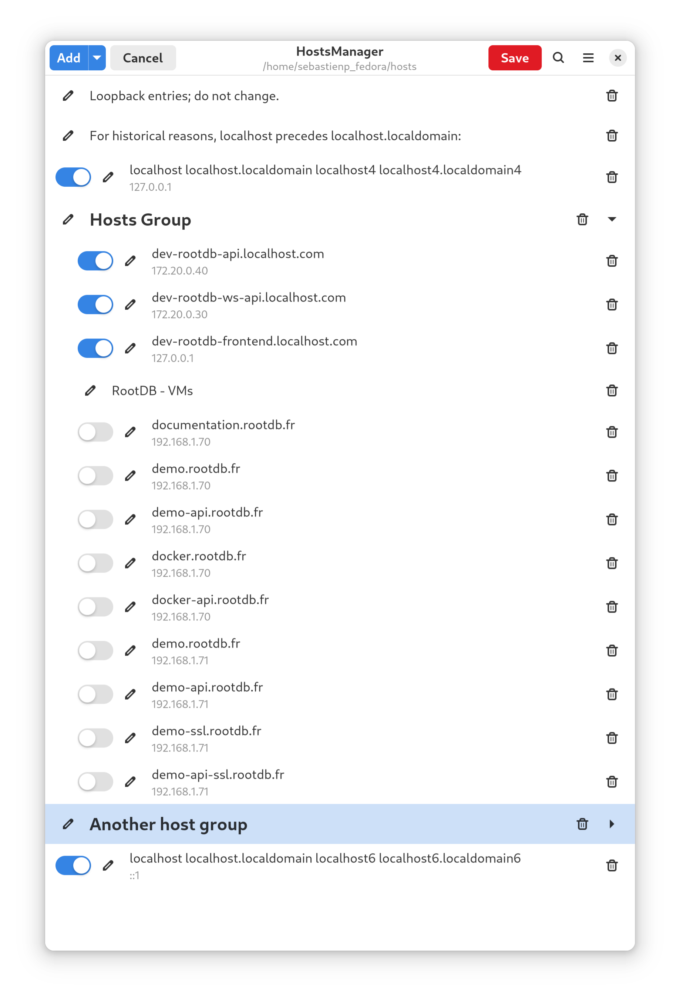

# HostsManager App


/!\ WIP - currently broken, updating code from GTK 3.x to GTK 4.x


Managing your `/etc/hosts` file.

<p align="center">
  
</p>


# Compilation & installation

```sh
meson build --prefix=/usr
cd build
ninja
sudo ninja install
```

# Development 

Done with [Builder](https://wiki.gnome.org/Apps/Builder), so you can compile and start the application directly with the development profile.
